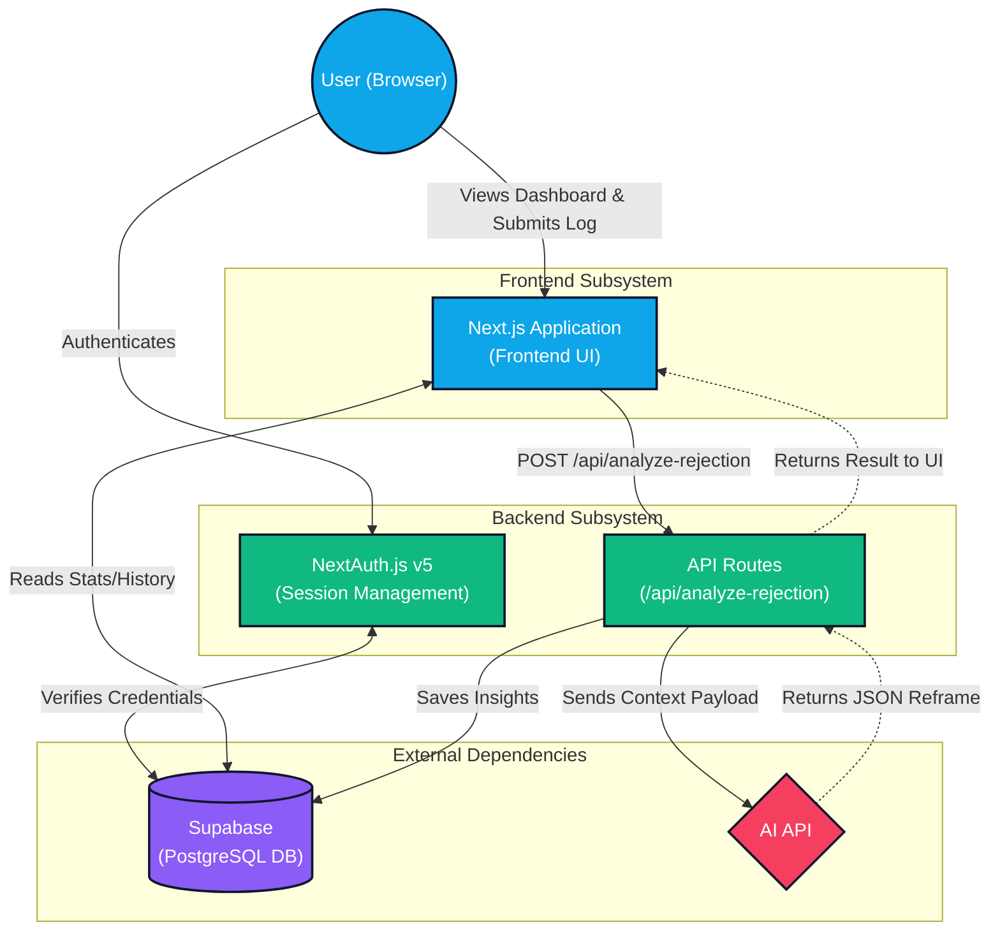

# REJECTED™

*“Collect 100 Rejections. Kill Your Fear.”*

## 🎯 Purpose

REJECTED™ is a psychology-grounded exposure therapy SaaS application. It gamifies the experience of seeking rejection to help individuals—specifically young men—build courage, social skill, and resilience. 

By flipping the script on failure and making rejection the explicit goal (the "30 Day Challenge"), the system systematically desensitizes users to the sting of "no." The core philosophy is simple: **Action absorbs anxiety. Avoidance creates it.**

## ⚙️ Technical Details & Stack

This application is built as a complete, production-ready Full-Stack SaaS utilizing modern web technologies:

*   **Frontend & Routing:** Next.js 14 (App Router) with TypeScript.
*   **Styling:** Tailwind CSS combined with Shadcn UI components for a robust, accessible, and ultra-modern tech-noir/cyberpunk aesthetic.
*   **Authentication:** NextAuth.js v5 (Auth.js) configured for robust session management.
*   **Database:** Supabase (Postgres) handling structured data for Users, Rejection Logs, and AI Insights.
*   **AI Integration:** API Routes designed to communicate with an AI engine, which processes log payloads and returns structured psychological reframes, cognitive distortion detection, and courage score calculations.
*   **Deployment:** Optimized for Vercel edge networks.

## 🏗️ Architecture Diagram

The following Mermaid diagram outlines the high-level system architecture and data flow:



## 🚀 Getting Started

To run the REJECTED™ application locally:

1.  **Clone the repository and navigate to the project directory:**
    ```bash
    cd rejected-app
    ```

2.  **Install the dependencies:**
    ```bash
    npm install
    ```

3.  **Configure Environment Variables:**
    Copy the `.env.example` file to `.env.local` and fill in your Supabase and Auth credentials:
    ```bash
    cp .env.example .env.local
    ```
    *Ensure `AUTH_SECRET` is set for NextAuth to function properly.*

4.  **Run the Development Server:**
    ```bash
    npm run dev
    ```

5.  Open [http://localhost:3000](http://localhost:3000) in your browser to access the terminal.
